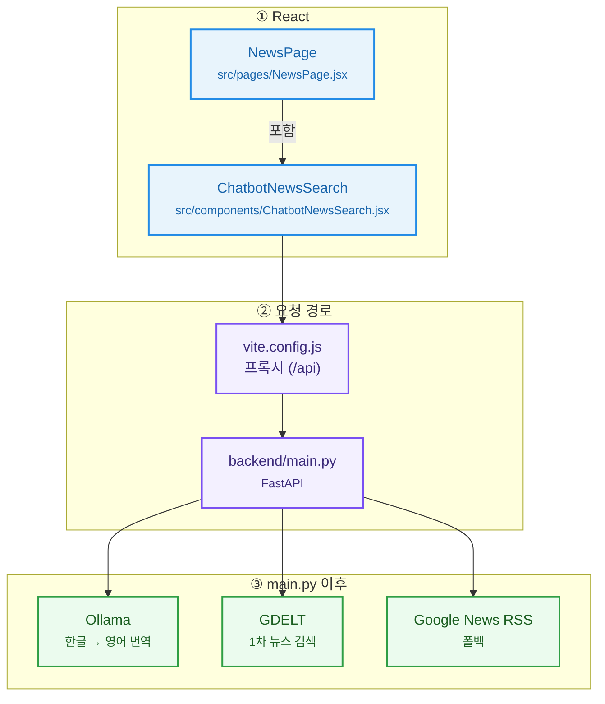

# React + Vite

This template provides a minimal setup to get React working in Vite with HMR and some ESLint rules.

Currently, two official plugins are available:

- [@vitejs/plugin-react](https://github.com/vitejs/vite-plugin-react/blob/main/packages/plugin-react) uses [Oxc](https://oxc.rs)
- [@vitejs/plugin-react-swc](https://github.com/vitejs/vite-plugin-react/blob/main/packages/plugin-react-swc) uses [SWC](https://swc.rs/)

## React Compiler

The React Compiler is not enabled on this template because of its impact on dev & build performances. To add it, see [this documentation](https://react.dev/learn/react-compiler/installation).

## Expanding the ESLint configuration

If you are developing a production application, we recommend using TypeScript with type-aware lint rules enabled. Check out the [TS template](https://github.com/vitejs/vite/tree/main/packages/create-vite/template-react-ts) for information on how to integrate TypeScript and [`typescript-eslint`](https://typescript-eslint.io) in your project.

## AI 챗봇(무료 LLM 기반) 뉴스 검색

React(Vite) 프론트에 파이썬(FastAPI) 백엔드를 붙여,
사용자가 입력한 **한글을 무료 로컬 LLM(Ollama)로 영어로 번역**한 뒤
**GDELT(무료, API Key 불필요)**에서 관련 뉴스 기사를 검색해 보여줍니다. (GDELT 실패 시 **Google News RSS**로 대체)

### 챗봇 흐름도

아래 **Mermaid 흐름도**는 챗봇이 거치는 경로를 한눈에 보여 줍니다. (GitHub·VS Code 미리보기 등 Mermaid 지원 환경에서 렌더링됩니다.)



**텍스트로 정리하면 다음과 같습니다.**

1. `NewsPage` (`src/pages/NewsPage.jsx`)가 `ChatbotNewsSearch` (`src/components/ChatbotNewsSearch.jsx`)를 **포함**
2. `ChatbotNewsSearch` → `vite.config.js` **프록시 (`/api`)** → `backend/main.py` (**FastAPI**)
3. `main.py` → **Ollama** (한글→영어 번역)
4. `main.py` → **GDELT** (1차 뉴스 검색) / **Google News RSS** (폴백)

### 실행 방법

프론트(React):

```bash
yarn dev
```

백엔드(FastAPI):

```bash
cd backend
python -m venv .venv
.venv\Scripts\activate
pip install -r requirements.txt
uvicorn main:app --reload --host 127.0.0.1 --port 8000
```

Ollama(무료 로컬 LLM) 준비:

```bash
# Ollama 설치 후 (새 터미널)
ollama pull llama3.2
ollama serve
```

기본 모델은 `llama3.2`이며, 환경변수로 바꿀 수 있습니다:

- `OLLAMA_MODEL` (예: `llama3.2`, `llama3.1`, 등)
- `OLLAMA_URL` (기본: `http://127.0.0.1:11434`)

프론트는 `vite.config.js` 프록시 설정으로 `/api/*` 요청을 `http://127.0.0.1:8000`으로 전달합니다.

### API

- `GET /api/health`: 상태 확인
- `POST /api/chat-search`: 한글 입력 → 번역 → 뉴스 검색

요청 예시:

```json
{ "message": "한국 반도체 수출 전망", "max_results": 3 }
```
